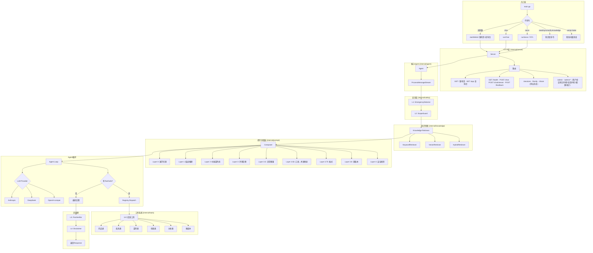
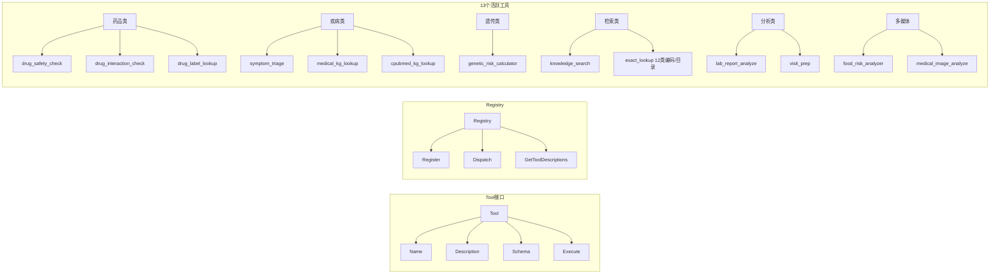
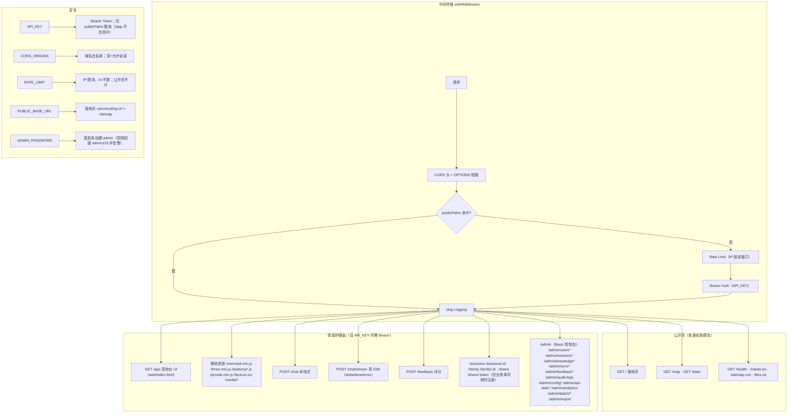
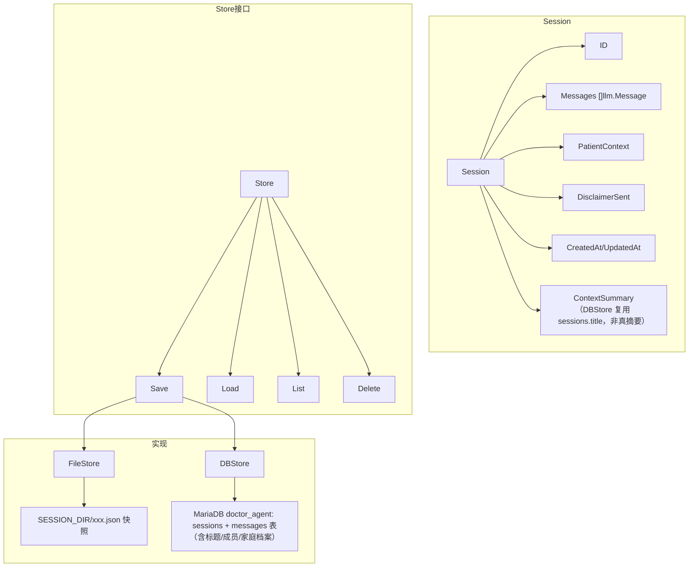
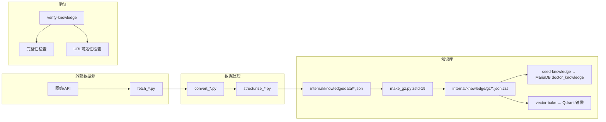
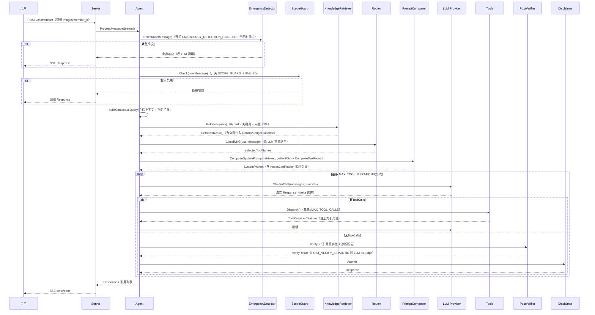

# Doctor Agent 架构图

## 整体架构

## 知识库体系

```mermaid
graph TB
    subgraph "Store (sync.Once单例)"
        A[Store]
        A --> B[MedicalEntries 多JSON汇聚]
        A --> C[DrugEntries]
        A --> D[FoodRiskEntries]
        A --> E[EmergencyRules]
        A --> F[LabTestReferences]
        A --> G[LiteratureArticles 4425/16主题]
        A --> H[MSDEntries 6127页]
        A --> I[ClinVarVariants 1399]
        A --> J[MedlinePlusEntries 1017]
        A --> K[MedinsDrugs 3618 2025版]
        A --> L[EMLEntries 564]
        A --> M[FDALabels 344]
        A --> N[NHCGuides 47]
        A --> O[FHSGuides 103]
        A --> P[AAPEntries 264]
        A --> Q[HealthMyths 16]
        A --> R[ICD10Diseases 35862]
        A --> S[NMPADrugs 167615]
        A --> T[MedicalKGTriples 354752]
        A --> U[DiseaseEncyclopedias 8807]
        A --> V[CPubMedTriples 105328]
        A --> W[HuatuoQAPairs 177703]
        A --> X[MedicalQAData 426978]
        A --> Y[TTDData 4299靶点]
        A --> Z[SIDERData 1507药]
        A --> ZA[ICD11Terms 35339]
        A --> ZB[HPOTerms 19836]
        A --> ZC[OrphanetDiseases 11647]
        A --> ZD[ICDO3Terms 1077]
        A --> ZE[CorpusDocs 10源 statpearls/medgen/lactmed/nhc_mental/firstaid/travel_health...]
    end

    subgraph "检索器"
        AA[Retriever] --> AB[KeywordRetriever]
        AA --> AC[VectorRetriever]
        AA --> AD[HybridRetriever]
    end

    B --> AA
    C --> AA
    D --> AA
```

## 工具系统

13个活跃工具已整合为统一检索架构：

> 📝 注：其他工具（reference_lookup, literature_search, msd_search, medline_search, drug_lookup, eml_lookup, nhc_search, fhs_search, aap_search, lab_interpreter, icd10_lookup, nmpa_drug_lookup, disease_encyclopedia_lookup, huatuo_qa_lookup, body_part_lookup, growth_assessment, milestone_lookup, newborn_care_lookup 等）已整合到 knowledge_search（统一语料/问答/全文层检索）与 exact_lookup（12 类精确编码：icd10/icd11/hpo/nmpa/variant/eml/fda_label/ttd/sider/medins/orphanet/icdo3）中。`internal/dialogue` 规则式意图包已删除（2026-09-20，死代码）。

## HTTP层

> `publicPaths`（免鉴权 + 免限流）= `/`、`/index.html`、`/map`、`/stats`、`/robots.txt`、`/sitemap.xml`、`/llms.txt`、`/health`。
> `/app`、懒加载 JS 资源、`/media/*` 与所有 API **都不豁免**——设了 `API_KEY` 时浏览器直连网页版会拿到 401，需要走带 token 的反代或客户端。

## 会话管理

## 数据管线

## 完整处理流程

