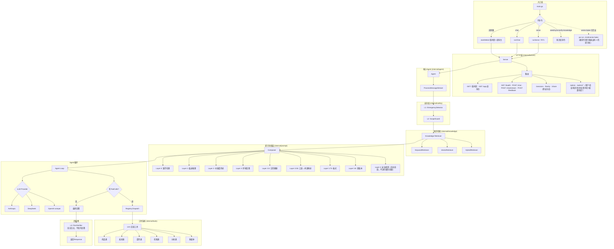
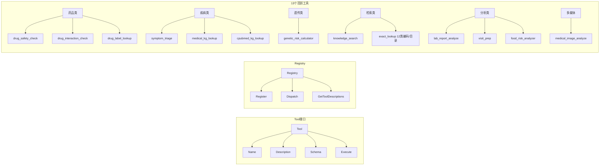
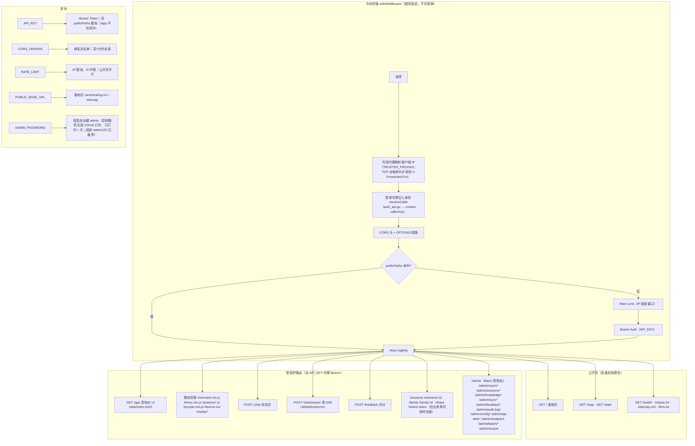
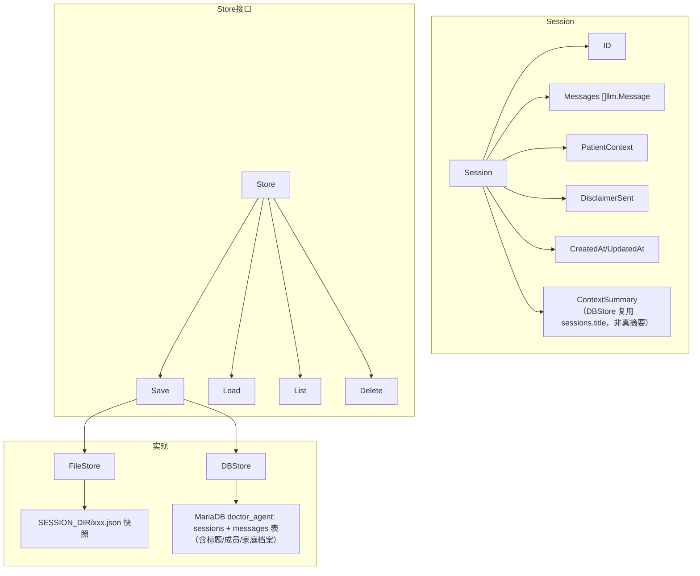
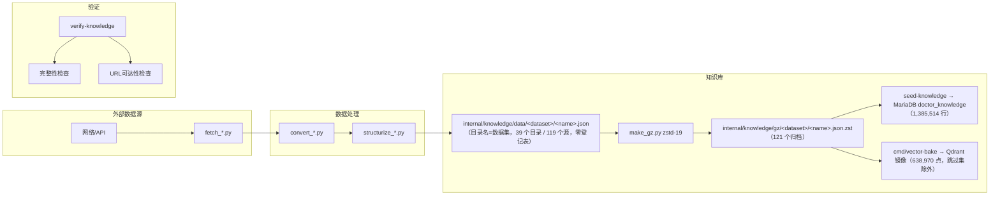
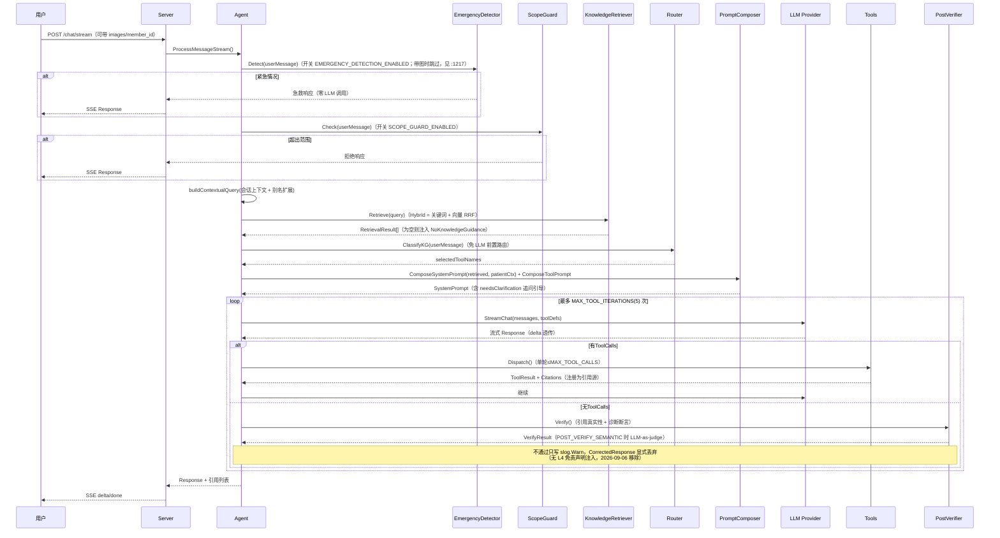

# Doctor Agent 架构图

## 整体架构

```mermaid
graph TB
    subgraph "入口层"
        A[main.go] --> B{子命令}
        B -->|无参数| C[startWebUI 落地页+咨询台]
        B -->|chat| D[runChat]
        B -->|serve| E[runServe :7071]
        B -->|seed/sync/verify-knowledge| W[知识库命令]
        B -.->|vector-bake 已迁出| X["go run ./cmd/vector-bake<br/>（根命令里只剩退出码 2 的提示桩）"]
    end

    subgraph "HTTP层 (internal/server)"
        C --> F[Server]
        D --> F
        E --> F
        F --> G[路由]
        G --> G1["GET / 落地页 · GET /app 咨询台"]
        G --> G2["GET /health · POST /chat · POST /chat/stream · POST /feedback"]
        G --> G3["/sessions · /family · /share（需业务库）"]
        G --> G4["/admin · /admin/*（用户/会话/知识/同步/反馈/审计/配置/统计）"]
    end

    subgraph "核心Agent (internal/agent)"
        F --> H[Agent]
        H --> I[ProcessMessageStream]
    end

    subgraph "安全层 (internal/safety)"
        I --> J[L1: EmergencyDetector]
        J --> K[L2: ScopeGuard]
    end

    subgraph "知识检索 (internal/knowledge)"
        K --> L[Knowledge Retriever]
        L --> L1[KeywordRetriever]
        L --> L2[VectorRetriever]
        L --> L3[HybridRetriever]
    end

    subgraph "提示词组装 (internal/prompt)"
        L --> M[Composer]
        M --> M1["Layer 0: 医学伦理"]
        M --> M2["Layer 1: 临床推理"]
        M --> M3["Layer 2: 中国遗传病"]
        M --> M4["Layer 3: 环境饮食"]
        M --> M5["Layer 3.5: 日常健康"]
        M --> M9["Layer 3.55: 口语↔术语映射"]
        M --> M6["Layer 3.75: 格式"]
        M --> M7["Layer 3.8: 双版本"]
        M --> M8["Layer 4: 安全规则（在动态段，不进可缓存前缀）"]
    end

    subgraph "Agent循环"
        M --> N[Agent Loop]
        N --> O{LLM Provider}
        O --> O1[Anthropic]
        O --> O2[DeepSeek]
        O --> O3[OpenAI-compat]
        N --> P{有ToolCalls?}
        P -->|是| Q[Registry.Dispatch]
        P -->|否| R[最终回答]
    end

    subgraph "工具系统 (internal/tools)"
        Q --> S[13个活跃工具]
        S --> S1[药品类]
        S --> S2[疾病类]
        S --> S3[遗传类]
        S --> S4[检索类]
        S --> S5[分析类]
        S --> S6[多媒体]
    end

    subgraph "后处理"
        R --> T[L3: PostVerifier<br/>仅记日志，不改写回答]
        T --> V[返回Response]
    end
```

> 图上原本还有一条 `L4: Disclaimer`（在答案尾部追加提示文字），2026-09-06 已按产品决策从正常回答里移除，因此现在的后处理只有 L3 一步：核查不通过只写 `slog.Warn`，`CorrectedResponse` 明确丢弃。`Response.DisclaimerSent` 只在 L1 急救与 L2 拒答两条短路上为 true。
> 提示词侧的切分线：**静态前缀 = 0/1/2/3/3.5/3.55/3.75/3.8 共 8 层**（`composer.go:35-70`，逐字节稳定才吃得到 Anthropic 前缀缓存），Layer 4 安全规则与患者上下文/引用表/知识原文摘录一起属于**动态段**（`ComposeDynamicSections:78-105`）。旧文档写「Layer 0–4 共 9 段」是把 Layer 4 错算进了静态。

## 知识库体系

```mermaid
graph TB
    subgraph "Store (sync.Once单例)"
        A[Store]
        A --> B["MedicalEntries 7325（medical 目录 73 个归档汇聚）"]
        A --> C[DrugEntries]
        A --> D[FoodRiskEntries]
        A --> E[EmergencyRules]
        A --> F[LabTestReferences]
        A --> G[LiteratureArticles 4425/16主题]
        A --> H[MSDEntries 6127页]
        A --> I[ClinVarVariants 1399]
        A --> J[MedlinePlusEntries 1017]
        A --> K[MedinsDrugs 3618 2025版]
        A --> L[EMLEntries 564]
        A --> M[FDALabels 344]
        A --> N[NHCGuides 69]
        A --> O[FHSGuides 103]
        A --> P[AAPEntries 264]
        A --> Q[HealthMyths 16]
        A --> R[ICD10Diseases 35862]
        A --> S[NMPADrugs 167615]
        A --> T[MedicalKGTriples 354752]
        A --> U[DiseaseEncyclopedias 8807]
        A --> V[CPubMedTriples 105328]
        A --> W[HuatuoQAPairs 177703]
        A --> X[MedicalQAData 426978]
        A --> Z[TTDData 4299靶点/29782药]
        A --> ZS["SIDERData 100药（行内 drug_count 字段写 1507，实际只带 100 条）"]
        A --> ZA[ICD11Terms 35339]
        A --> ZB[HPOTerms 19836]
        A --> ZC[OrphanetDiseases 11647]
        A --> ZD[ICDO3Terms 1077]
        A --> ZE[CorpusDocs 10源 statpearls/medgen/lactmed/nhc_mental/firstaid/travel_health...]
    end

    subgraph "检索器"
        AA[Retriever] --> AB[KeywordRetriever]
        AA --> AC[VectorRetriever]
        AA --> AD[HybridRetriever]
    end

    B --> AA
    C --> AA
    D --> AA
```

## 工具系统

13个活跃工具已整合为统一检索架构：

```mermaid
graph LR
    subgraph "Tool接口"
        A[Tool] --> B[Name]
        A --> C[Description]
        A --> D[Schema]
        A --> E[Execute]
    end

    subgraph "Registry"
        F[Registry] --> G[Register]
        F --> H[Dispatch]
        F --> I[GetToolDescriptions]
    end

    subgraph "13个活跃工具"
        J[药品类] --> J1[drug_safety_check]
        J --> J2[drug_interaction_check]
        J --> J3[drug_label_lookup]

        K[疾病类] --> K1[symptom_triage]
        K --> K2[medical_kg_lookup]
        K --> K3[cpubmed_kg_lookup]

        L[遗传类] --> L1[genetic_risk_calculator]

        M[检索类] --> M1[knowledge_search]
        M --> M2[exact_lookup 12类编码/目录]

        N[分析类] --> N1[lab_report_analyze]
        N --> N2[visit_prep]
        N --> N3[food_risk_analyzer]

        O[多媒体] --> O2[medical_image_analyze]
    end
```

> 分类只是阅读方便，不是代码结构：`food_risk_analyzer` 属于食物/风险类，和 `drug_*` 一样是独立工具，注册顺序见 `internal/agent/agent.go:153-169`。
> ✅ **注册 ≠ 可见（2026-10-04 已修）**：模型每轮能调的工具名来自 `internal/tools/router.go` 的 `toolGroups` / `relationToTools`，只注册不进这两张表等于对模型不可达。`drug_label_lookup`、`lab_report_analyze`、`visit_prep` 曾经两个表里都没有，现已各自入组（标签查询进 CatDrug/CatGeneral，化验单进 CatLab/CatImage，就诊准备进 CatSymptom/CatDisease/CatGeneral，并补进 `relationToTools` 的相关关系）。回归门 `internal/tools/router_visibility_test.go` 双向锁死：13 个在册工具必须全部可路由，路由表里也不许出现已退役的名字。

> 📝 注：其他工具（reference_lookup, literature_search, msd_search, medline_search, drug_lookup, eml_lookup, nhc_search, fhs_search, aap_search, lab_interpreter, icd10_lookup, nmpa_drug_lookup, disease_encyclopedia_lookup, huatuo_qa_lookup, body_part_lookup, growth_assessment, milestone_lookup, newborn_care_lookup 等）已整合到 knowledge_search（统一语料/问答/全文层检索）与 exact_lookup（12 类精确编码：icd10/icd11/hpo/nmpa/variant/eml/fda_label/ttd/sider/medins/orphanet/icdo3）中。`internal/dialogue` 规则式意图包已删除（2026-09-20，死代码）。

## HTTP层

```mermaid
graph TB
    subgraph "中间件链 withMiddleware（顺序固定，不可调换）"
        A[请求] --> Z0["可信代理解析客户端 IP<br/>（TRUSTED_PROXIES：TCP 对端命中才采信 X-Forwarded-For）"]
        Z0 --> Z1["登录令牌注入身份 resolveCaller<br/>（auth_api.go → context callerKey）"]
        Z1 --> B[CORS 头 + OPTIONS 短路]
        B --> P{publicPaths 命中?}
        P -->|是| E[slog Logging]
        P -->|否| C["Rate Limit（IP 固定窗口）"]
        C --> D["Bearer Auth（API_KEY）"]
        D --> E
    end

    subgraph "公开页（免鉴权免限流）"
        E --> G0["GET / 落地页"]
        E --> G0b["GET /map · GET /stats"]
        E --> G0c["GET /health · /robots.txt · /sitemap.xml · /llms.txt"]
    end

    subgraph "受保护路由（设 API_KEY 时需 Bearer）"
        E --> U1["GET /app 咨询台 UI（web/index.html）"]
        E --> U2["静态资源 /mermaid.min.js /three.min.js /anatomy*.js /qrcode.min.js /favicon.ico /media/*"]
        E --> R1["POST /chat 非流式"]
        E --> R2["POST /chat/stream 真 SSE（delta/done/error）"]
        E --> R3["POST /feedback 评分"]
        E --> R4["/sessions /sessions/:id · /family /family/:id · /share /share/:token（仅业务库可用时注册）"]
        E --> R5["/admin（Basic 控制台）· /admin/users* /admin/sessions* /admin/knowledge* /admin/sync* /admin/feedback* /admin/audit-logs /admin/config* /admin/api-stats* /admin/analytics /admin/batch/* /admin/export"]
    end

    subgraph "安全"
        O[API_KEY] --> P2["Bearer Token；仅 publicPaths 豁免（/app 不在其中）"]
        Q[CORS_ORIGINS] --> R[域名白名单；空=允许全部]
        S[RATE_LIMIT] --> T["IP 限流，0=不限；公开页不计"]
        PB[PUBLIC_BASE_URL] --> V["落地页 canonical/og:url + sitemap"]
        AD[ADMIN_PASSWORD] --> AE["首启自动建 admin（空则随机生成 128-bit 口令、只打印一次；固定 admin123 已废弃）"]
    end
```

> `publicPaths`（免鉴权 + 免限流）= `/`、`/index.html`、`/map`、`/stats`、`/robots.txt`、`/sitemap.xml`、`/llms.txt`、`/health`。
> `/app`、懒加载 JS 资源、`/media/*` 与所有 API **都不豁免**——设了 `API_KEY` 时浏览器直连网页版会拿到 401，需要走带 token 的反代或客户端。

## 会话管理

```mermaid
graph TB
    subgraph "Session"
        A[Session] --> B[ID]
        A --> C["Messages []llm.Message"]
        A --> D[PatientContext]
        A --> E[DisclaimerSent]
        A --> F[CreatedAt/UpdatedAt]
        A --> G2["ContextSummary（DBStore 复用 sessions.title，非真摘要）"]
    end

    subgraph "Store接口"
        G[Store] --> H[Save]
        G --> I[Load]
        G --> J[List]
        G --> K[Delete]
    end

    subgraph "实现"
        H --> I1[FileStore]
        H --> I2[DBStore]
        I1 --> J1["SESSION_DIR/xxx.json 快照"]
        I2 --> J2["MariaDB doctor_agent: sessions + messages 表（含标题/成员/家庭档案）"]
    end
```

## 数据管线

```mermaid
graph LR
    subgraph "外部数据源"
        A[网络/API] --> B[fetch_*.py]
    end

    subgraph "数据处理"
        B --> C[convert_*.py]
        C --> D[structurize_*.py]
    end

    subgraph "知识库"
        D --> E["internal/knowledge/data/&lt;dataset&gt;/&lt;name&gt;.json<br/>（目录名=数据集，39 个目录 / 119 个源，零登记表）"]
        E --> F[make_gz.py zstd-19]
        F --> G["internal/knowledge/gz/&lt;dataset&gt;/&lt;name&gt;.json.zst<br/>（121 个归档）"]
        G --> H1["seed-knowledge → MariaDB doctor_knowledge（1,385,514 行）"]
        G --> H2["cmd/vector-bake → Qdrant 镜像（638,970 点，跳过集除外）"]
    end

    subgraph "验证"
        I[verify-knowledge] --> J[完整性检查]
        I --> K[URL可达性检查]
    end
```

> 图上的 `fetch_*.py → convert_*.py → structurize_*.py` 是历史一次性转换器的形状；现在**活管线只有 6 条**（`make_gz.py`、`split_data.py`、`bake_onnx.py`、`embed_server.py`、`export_onnx.py`、`external/medkb/`），清单与哪些脚本仍写平铺路径见 `external/AGENTS.md`。
> 图里的数字（39/119/121/1,385,514/638,970）是最容易过期的一类陈述，别引用它们做判断——自己测：
> `ls internal/knowledge/data | wc -l`、`find internal/knowledge/data -name '*.json' | wc -l`、`find internal/knowledge/gz -name '*.zst' | wc -l`、`SELECT COUNT(*) FROM kb_items`、`go run ./cmd/vector-bake` 的预检行。

## 完整处理流程

```mermaid
sequenceDiagram
    participant U as 用户
    participant S as Server
    participant A as Agent
    participant E as EmergencyDetector
    participant SC as ScopeGuard
    participant KR as KnowledgeRetriever
    participant R as Router
    participant PC as PromptComposer
    participant LLM as LLM Provider
    participant T as Tools
    participant PV as PostVerifier

    U->>S: POST /chat/stream（可带 images/member_id）
    S->>A: ProcessMessageStream()

    A->>E: Detect(userMessage)（开关 EMERGENCY_DETECTION_ENABLED；带图时跳过，见 :1217）
    alt 紧急情况
        E-->>S: 急救响应（零 LLM 调用）
        S-->>U: SSE Response
    end

    A->>SC: Check(userMessage)（开关 SCOPE_GUARD_ENABLED）
    alt 超出范围
        SC-->>S: 拒绝响应
        S-->>U: SSE Response
    end

    A->>A: buildContextualQuery(会话上下文 + 别名扩展)
    A->>KR: Retrieve(query)（Hybrid = 关键词 + 向量 RRF）
    KR-->>A: RetrievalResult[]（为空则注入 NoKnowledgeGuidance）

    A->>R: ClassifyKG(userMessage)（免 LLM 前置路由）
    R-->>A: selectedToolNames
    A->>PC: ComposeSystemPrompt(retrieved, patientCtx) + ComposeToolPrompt
    PC-->>A: SystemPrompt（含 needsClarification 追问引导）

    loop 最多 MAX_TOOL_ITERATIONS(5) 次
        A->>LLM: StreamChat(messages, toolDefs)
        LLM-->>A: 流式 Response（delta 透传）

        alt 有ToolCalls
            A->>T: Dispatch()（单轮≤MAX_TOOL_CALLS）
            T-->>A: ToolResult + Citations（注册为引用源）
            A->>LLM: 继续
        else 无ToolCalls
            A->>PV: Verify()（引用真实性 + 诊断断言）
            PV-->>A: VerifyResult（POST_VERIFY_SEMANTIC 时 LLM-as-judge）
            Note over A,PV: 不通过只写 slog.Warn，CorrectedResponse 显式丢弃<br/>（无 L4 免责声明注入，2026-09-06 移除）
        end
    end

    A-->>S: Response + 引用列表
    S-->>U: SSE delta/done
```
